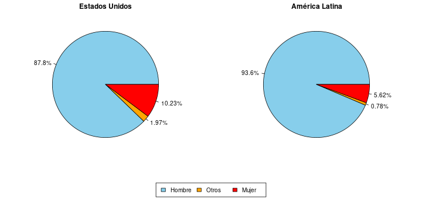
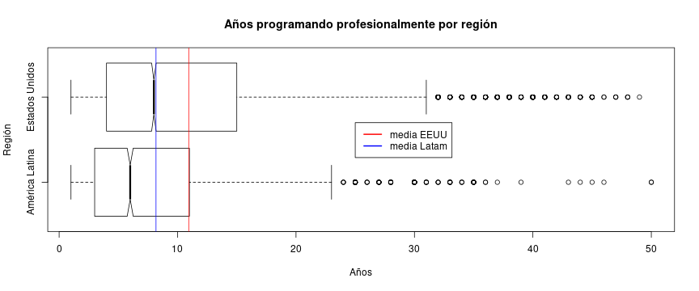
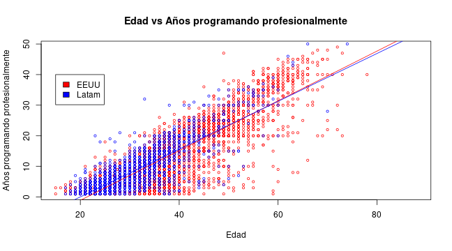
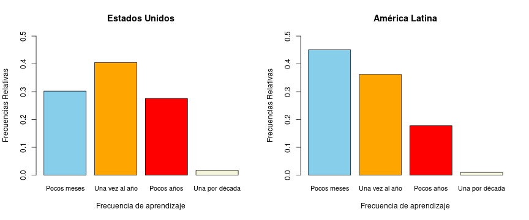
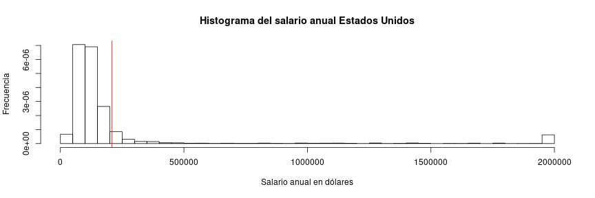
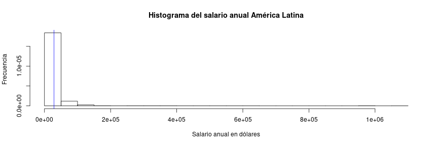
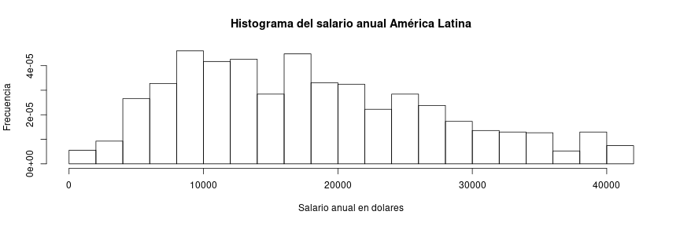

Las diferencias en el aspecto educativo y laboral entre programadores de Estados Unidos y de América Latina en 2020
========================================================
author: G8: Luis Berrospi, Bryan Castillo, Luis Robledo, Jorge Collazos, Nincol Quiroz 
date: 11-06-2021

Introducción
========================================================

Son muchas las personas que se dedican profesionalmente a programar en todo el mundo. Sin embargo, las características de estas y el contexto en el que viven no son iguales. Por esto, nos planteamos esto objetivos

-   Identificar la existencia de diferencias en el aspecto educativo y laboral entre programadores profesionales de América Latina y Estados Unidos.

-   Identificar el grado de las diferencias, así como cuales son las que presentan mayor brecha

-   Identificar las variables que no presentan diferencia alguna

Marco teórico
========================================================
-   **Población objetivo:** Personas que son o fueron programadores profesionales y son de América Latina o de Estados Unidos

-   **Muestra:** Programadores profesionales que usan constantemente el foro "Stack Overflow"

-   **Muestreo:** Por conveniencia

-   **Base de Datos:** La base de datos es el resultado de la Stack Overflow Developer Survey 2020, esta encuesta busca saber cómo cualquier persona que sabe programar es que aprenden, cuales herramientas usan y como se relacionan con el foro. La base de datos cuenta con cerca de 65000 observaciones totales y 61 variables, pero para este trabajo, delimitamos las observaciones según lo realmente necesitábamos.


Variables
========================================================


Patrones destacados
========================================================
Se mostrarán los patrones más destacados que encontramos en nuestro estudio al responder las preguntas de investigación

¿Cuál es la diferencia entre el género de los desarrolladores profesionales según la región en la que viven?
========================================

Variable: Género
========================================================
class: slide

- Brecha de género de más de 70 puntos porcentuales en ambas regiones
- **Hipótesis**: sin importar la región en la que viven, la gran mayoría de desarrolladores profesionales son hombres.

¿Cuál es la diferencia entre la edad de los desarrolladores profesionales según la región en la que viven?
========================================================


Variable: Edad
========================================================


- Mediana EEUU: 29
- Mediana América Latina: 32
- **Hipótesis**: Los desarrolladores de Estados Unidos tienen más años que los de América Latina, sin embargo, son solo unos 3 años más.


¿Existe diferencia entre los años que llevan programando de manera profesional los desarrolladores de Estados Unidos y los de América Latina?
========================================================

Variable: Años programando profesionalmente
========================================================

- Diferencia en 3er cuartil de 4 años
- Mediana EEUU: 8 - Mediana América latina: 6
- **Hipótesis**: Si existe, pero esta es pequeña, ronda los 2 años

¿Existe diferencia entre la relación que hay entre estás dos variables anteriores?
========================================================

Relación: edad y años programando profesionalmente
========================================================

- Correlación EEUU: 0.87 - Correlación América Latina: 0.84
- **Hipótesis**: En ambos casos la correlación es alta, la región no influye.

Predicción
========================================================
- La alta correlación permite realizar una predicción. Obtenemos los años de experiencia en el ámbito laboral en función de la edad
- Estados Unidos:   f(edad) = 0.81 × edad - 17.34
- América Latina:   f(edad) = 0.78 × edad - 15.58
- Se podría decir que un programador de 35 años debería tener 11 años de experiencia en Estados Unidos y un poco menos de 12 en América latina.
- Lógicamente tendrá cierto margen de error.

¿Cómo influye la región en la que los desarrolladores profesionales viven en la frecuencia con la que aprenden un nuevo lenguaje?
========================================================
Variable: Frecuencia de aprendizaje de un nuevo lenguaje
========================================================

- Moda EEUU: Una vez al año - Moda Latam: Cada pocos meses
- **Hipótesis**: Los programadores de América Latina aprenden nuevos lenguajes con mayor frecuencia, por lo que se podría decir que saben utilizar un mayor numero de lenguajes

¿Existe una relación entre la remuneración anual total y la región en la que los desarrolladores viven?
========================================================
Variable: Remuneración anual en dólares
========================================================


Filtrado de datos
========================================================
- No hay evidencia suficiente para eliminar los datos "atípicos"
- Se considerará un rango de sueldo "estándar" según fuentes bibliográficas con los sueldos de empleados tiempo completo y revisando que concuerde con el gráfico original.
- Sueldo estándar en Estados Unidos: por debajo de 171000 USD
- Sueldo estándar en América Latina: por debajo de 42000 USD

Remuneración anual en dólares con sueldo estándar 
========================================================


=================================
- mediana Estados Unidos: 104000 USD
- mediana América Latina: 16488 USD
- **Hipótesis**: Para un sueldo estándar, hay una relación muy fuerte. La mediana del sueldo de los programadores de Estados Unidos representa el 630.76% del de los de América Latina

¿Cuál es la probabilidad de que un desarrollador profesional de Estados Unidos o de América latina tenga un sueldo anual "estándar"?
=========================================
- Distribución Bernoulli
- Éxito: Tiene sueldo estándar
- Fracaso: No tiene un sueldo estándar


- Probabilidad de éxito en Estados Unidos: 

```
[1] 0.84
```
- Probabilidad de éxito en América Latina: 

```
[1] 0.91
```


