Las diferencias en el aspecto educativo y laboral entre programadores de Estados Unidos y de América Latina en 2020
========================================================
author: G8: Luis Berrospi, Bryan Castillo, Luis Robledo, Jorge Collazos, Nincol Quiroz 
date: 11-06-2021


Introducción
========================================================

Son muchas las personas que se dedican profesionalmente a programar en todo el mundo. Sin embargo, las características de estas y el contexto en el que viven no son iguales. Por esto, nos planteamos esto objetivos

-   Identificar la existencia de diferencias en el aspecto educativo y laboral entre programadores profesionales de América Latina y Estados Unidos.

-   Identificar el grado de las diferencias, así como cuales son las que presentan mayor brecha

-   Identificar las variables que no presentan diferencia alguna

Marco teórico
========================================================
-   **Población objetivo:** Personas que son o fueron programadores profesionales y son de América Latina o de Estados Unidos

-   **Muestra:** Programadores profesionales que usan constantemente el foro "Stack Overflow"

-   **Muestreo:** Por conveniencia

-   **Base de Datos:** La base de datos es el resultado de la Stack Overflow Developer Survey 2020, esta encuesta busca saber cómo cualquier persona que sabe programar es que aprenden, cuales herramientas usan y como se relacionan con el foro. La base de datos cuenta con cerca de 65000 observaciones totales y 61 variables, pero para este trabajo, delimitamos las observaciones según lo realmente necesitábamos.


Variables
========================================================


Parámetros del estudio
========================================================
- Nivel de confianza: 90%
- Tamaño de muestra: 12486 observaciones (3032 América latina, 9454 Estados Unidos)
- Precisión: 

Intervalo de confianza
========================================================
Se utilizará la distribución t de student

```r
ic <- function(x, p) {
  m <- mean(x, na.rm = TRUE)
  a <- 1- p
  n <- sum(!is.na(x))
  s <- sd(x[!is.na(x)])
  
  izq <- m - qt(a/2, n-1, lower.tail = FALSE)*s/sqrt(n)
  der <- m + qt(a/2, n-1, lower.tail = FALSE)*s/sqrt(n)
  return (cat("(",izq, ", ", der, ")\n"))
}
```

¿Cuál es la diferencia entre la edad de los desarrolladores profesionales según la región en la que viven?
========================================================


Variable: Edad
========================================================

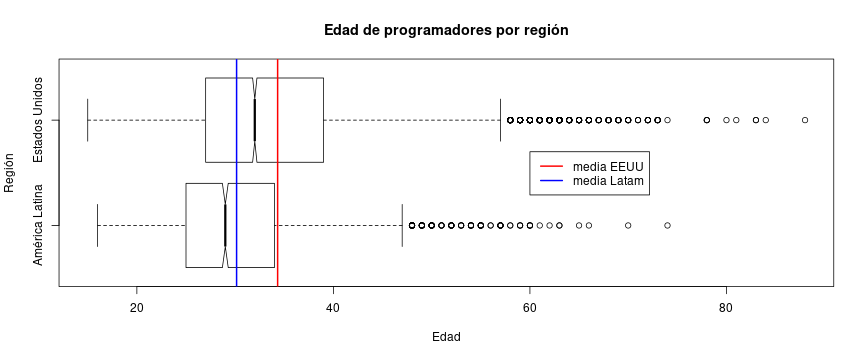
- Mediana EEUU: 29
- Mediana América Latina: 32
- **Hipótesis**: Los desarrolladores de Estados Unidos tienen más años que los de América Latina, sin embargo, son solo unos 3 años más.

Intervalo de confianza
========================================================
Intervalos excluyentes

```r
ic(DF_LA$Age, 0.9)
```

```
( 29.88362 ,  30.41433 )
```

```r
ic(DF_USA$Age, 0.9)
```

```
( 34.13334 ,  34.51723 )
```


Prueba de hipótesis de diferencia de medias
========================================================

$H_{0}:$ La diferencia de medias de edades entre Estados unidos y América Latina es 0 o negativa

$$H_{0}: x_{usa}-x_{latam} \le 0$$

$H_a:$ La diferencia de medias de edades entre Estados unidos y América Latina es positiva

$$H_a: x_{usa}-x_{latam} \gt 0$$

Prueba T Comparación de medias
========================================================

```r
t.test(DF_USA$Age, DF_LA$Age, mu = 0, conf.level = 0.9, alternative="greater")
```

```

	Welch Two Sample t-test

data:  DF_USA$Age and DF_LA$Age
t = 20.982, df = 4894.9, p-value < 2.2e-16
alternative hypothesis: true difference in means is greater than 0
90 percent confidence interval:
 3.921193      Inf
sample estimates:
mean of x mean of y 
 34.32528  30.14897 
```
Rechazamos la hipótesis nula

¿La media de las edades en Estados Unidos está por encima de una media de los programadores profesionales a nivel global mientras que la de América Latina está por debajo?
========================================================

Prueba de hipótesis para la media de edad Estados Unidos
========================================================


Prueba T Estados Unidos
========================================================

```r
t.test(DF_USA$Age, mu = 32, conf.level = 0.90, alternative="greater")
```

```

	One Sample t-test

data:  DF_USA$Age
t = 19.929, df = 7458, p-value < 2.2e-16
alternative hypothesis: true mean is greater than 32
90 percent confidence interval:
 34.17574      Inf
sample estimates:
mean of x 
 34.32528 
```


Prueba de hipótesis para la media de edad América Latina
========================================================

Prueba T América latina
========================================================

```r
t.test(DF_LA$Age, mu = 32, conf.level = 0.90, alternative="less")
```

```

	One Sample t-test

data:  DF_LA$Age
t = -11.479, df = 2286, p-value < 2.2e-16
alternative hypothesis: true mean is less than 32
90 percent confidence interval:
     -Inf 30.35569
sample estimates:
mean of x 
 30.14897 
```


¿Existe una relación entre la remuneración anual total y la región en la que los desarrolladores viven?
========================================================

Variable: Remuneración anual en dólares
========================================================

Estados Unidos
========================================================

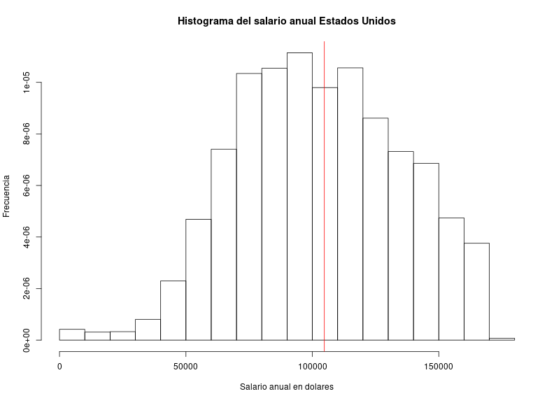

América Latina
=================================

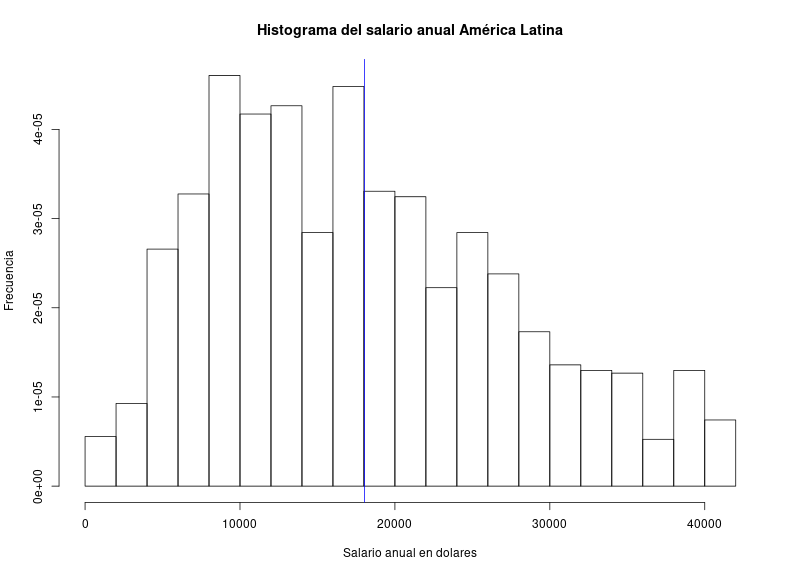


=================================
- mediana Estados Unidos: 104000 USD
- mediana América Latina: 16488 USD
- **Hipótesis**: Para un sueldo estándar, hay una relación muy fuerte. La mediana del sueldo de los programadores de Estados Unidos representa el 630.76% del de los de América Latina

Intervalo de confianza
=========================================
Intervalos excluyentes
- América Latina

```r
ic(DF_FT_LA_STD$ConvertedComp, 0.9)
```

```
( 17640.48 ,  18427.86 )
```
- Estados Unidos

```r
ic(DF_FT_USA_STD$ConvertedComp, 0.9)
```

```
( 104002 ,  105473.7 )
```

¿La media del sueldo anual en Estados Unidos está por encima de la media del sueldo anual de los programadores profesionales a nivel global mientras que la de América Latina está por debajo?
=========================================

Prueba de hipótesis para la media del sueldo anual Estados Unidos
========================================================

Prueba T
========================================================

Prueba de hipótesis para la media del sueldo anual América Latina
========================================================

Prueba T
========================================================


¿Existe diferencia entre la relación que hay entre la edad de los desarrolladores profesionales y los años que llevan programando profesionalmente?
========================================================

Edad vs Años programando profesionalmente
========================================================

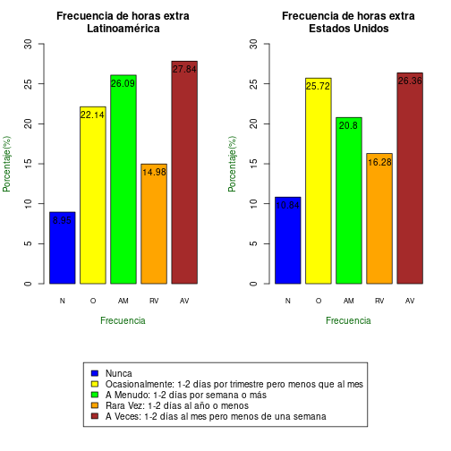

Correlación
======================
- Estados Unidos

```r
cor(y = DF_USA$Age,x = DF_USA$YearsCodePro, use = "pairwise.complete.obs")
```

```
[1] 0.8703693
```
- América Latina

```r
cor(y = DF_LA$Age,x = DF_LA$YearsCodePro, use = "pairwise.complete.obs")
```

```
[1] 0.8382195
```

Verificación de Estados Unidos
======================

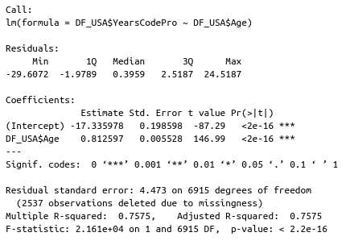

Resultados
========================
- Explica cerca del 75% de las observaciones
- p valores de las variables menor que la significancia de 0.1, por lo que rechazamos hipótesis nula:
$$H_0: \text{El coeficiente es 0}$$
- p valor obtenida de la prueba F de Fisher menor que nuestra significancia, por lo que rechazamos hipótesis nula:
$$H_0: \text{El modelo no explica nada}$$

Análisis de graficas del modelo
=====================
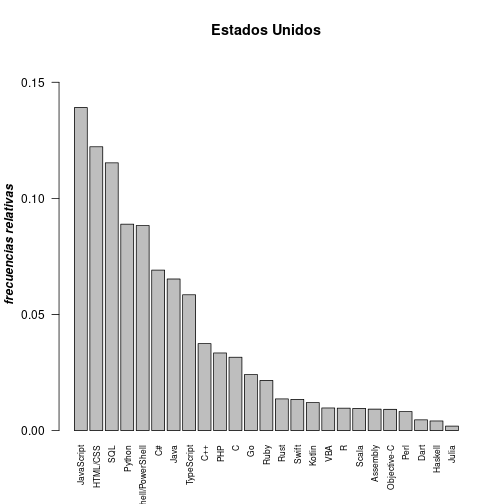

=====================
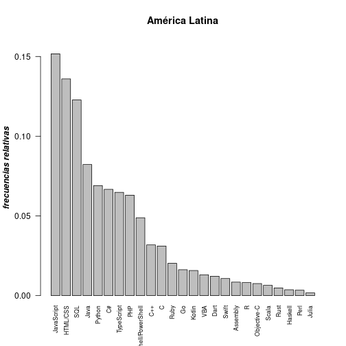

=====================
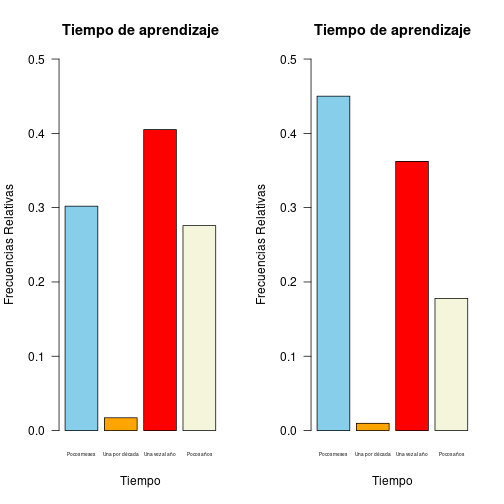

=====================
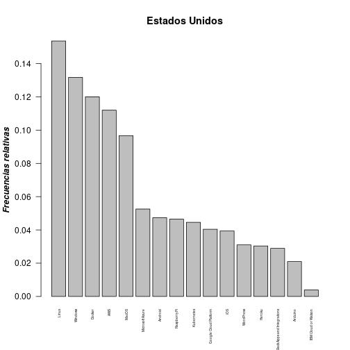


====================
Podemos ver que hay ciertos valores que tienen un peso excesivo en nuestro modelo y lo alteran, estos son los siguientes:
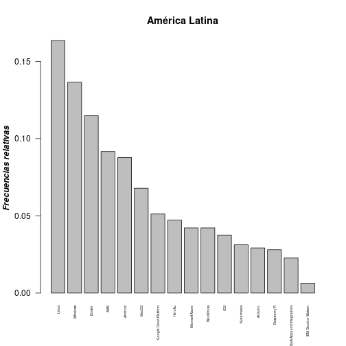


Verificación de América Latina
======================

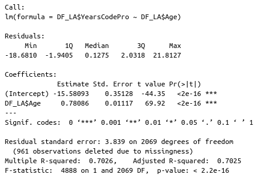

Resultados
========================
- Explica cerca del 70% de las observaciones
- p valores de las variables menor que la significancia de 0.1, por lo que rechazamos hipótesis nula:
$$H_0: \text{El coeficiente es 0}$$
- p valor obtenida de la prueba F de Fisher menor que nuestra significancia, por lo que rechazamos hipótesis nula:
$$H_0: \text{El modelo no explica nada}$$

Análisis de graficas del modelo
=====================
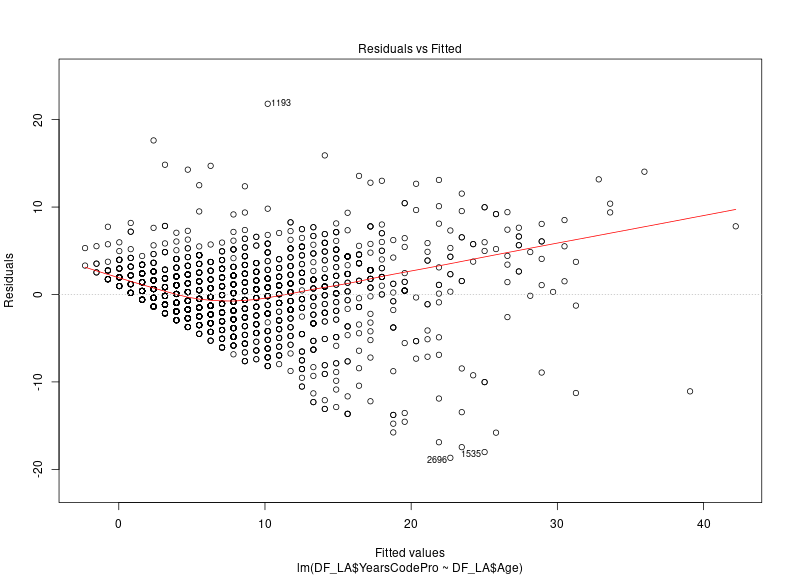

=====================
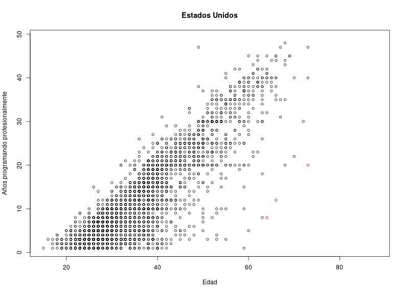

=====================
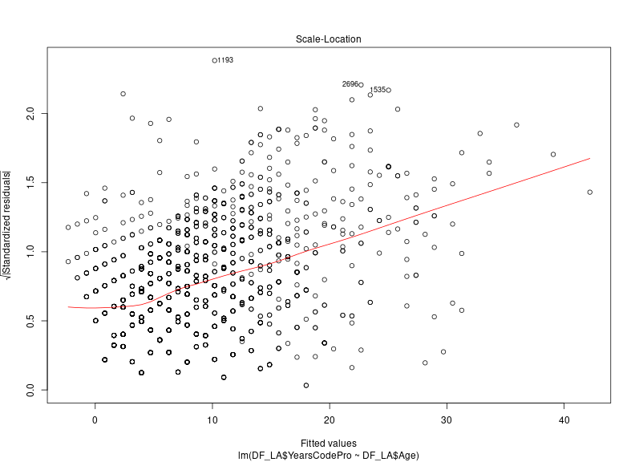

=====================
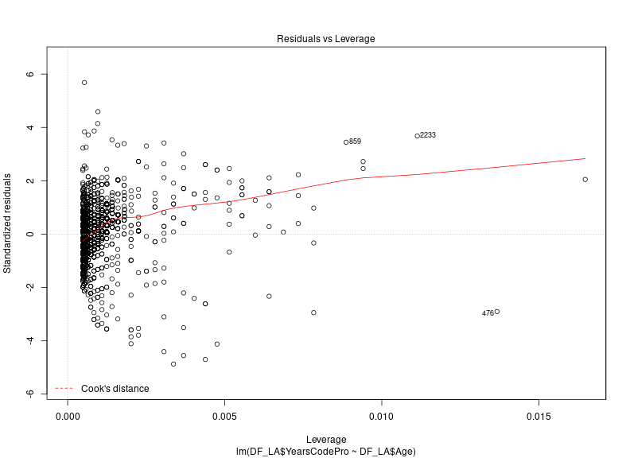


====================
Podemos ver que hay ciertos valores que tienen un peso excesivo en nuestro modelo y lo alteran, estos son los siguientes:
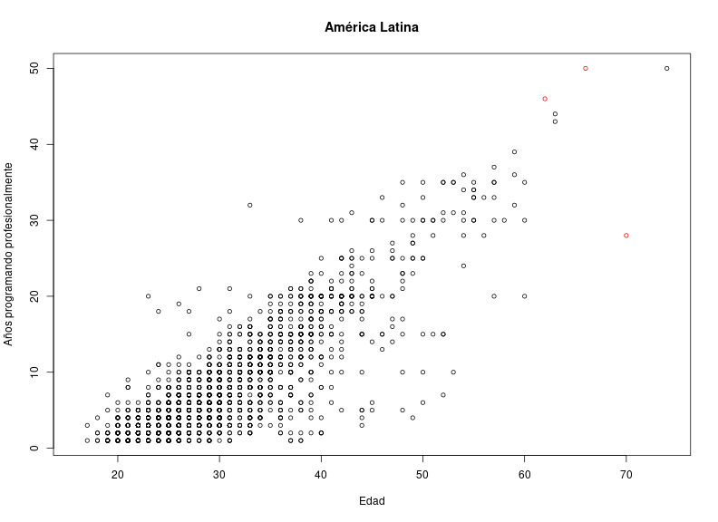


